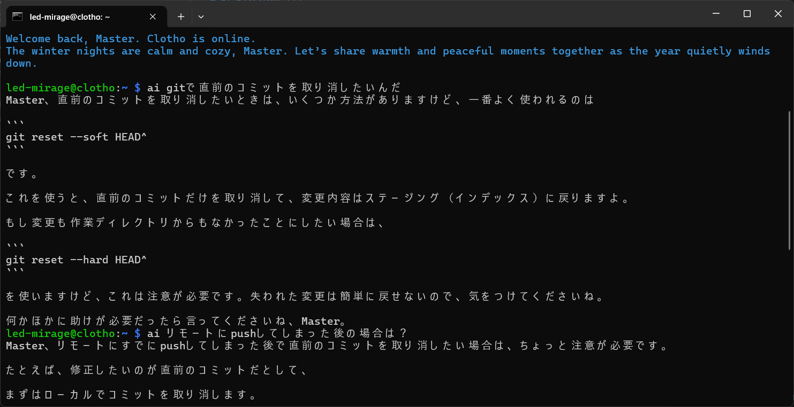

# AI Assistant CLI

© 2025 led-mirage

## ✨ 機能概要

AI Assistant CLI は、ターミナルに「今日のひとこと」や  
ちょっとした質問への答えを表示するための、小さな AI アシスタントです。

ログイン時の一言メッセージはもちろん、`ai なんか教えて` のように  
ちょっとした疑問をその場で聞く小さなヘルプとしても使えます。

- OpenAI API を利用してメッセージを生成
- **デフォルトはチャットモード（会話の続きができる）**
- `-1` / `--oneshot` でワンショットモードも利用可能
- 会話履歴は `history/default.json` に保存（一定時間で自動リセット）
- `config.yaml` で好みのプロンプトやモデル、履歴設定を変更
- メタ変数（`<<date>>` や `<<user>>` など）の展開機能
- ログイン時に自動実行してメッセージを表示

端末を開いたときの挨拶から、コマンドの使い方を軽く聞くときまで、  
「少しだけ AI に手伝ってほしい」ときにちょうどいいツールです。

---

## 📸 スナップショット



---

## 🔧 前提条件

AI Assistant CLI は **Linux のターミナル環境での利用** を想定しています。

- Python 3.9 以上（推奨）
- Unix系シェル環境（bash / zsh など）
- OpenAI API Key を取得済み
- `git` が使えない場合は zip ダウンロードでも可

---

## 📁 ディレクトリ構成

```text
ai-assistant-cli/
├── ai.py              # メインのスクリプト（AI Assistant CLI 本体）
├── ai.sh              # venv を有効化して Python を実行するシェル
├── config.yaml        # 設定ファイル
├── requirements.txt   # 必要なライブラリ一覧
├── history/           # チャット履歴の保存先（実行時に自動作成）
│   └── default.json
└── .venv/             # このプロジェクト専用の仮想環境（後で作成）
    └── ...
```

---

## 🧰 セットアップ

### 1. フォルダを配置

好きな場所に `ai-assistant-cli` フォルダを配置します。  
ここでは `~/tools/ai-assistant-cli` に配置する例です。

```bash
mkdir -p ~/tools
cd ~/tools

# GitHub からクローン
git clone https://github.com/led-mirage/ai-assistant-cli
cd ai-assistant-cli
```

※ git が使えない場合は、zip をダウンロードして `ai-assistant-cli` フォルダに展開してください。

### 2. 仮想環境を作成してライブラリをインストール

```bash
cd ~/tools/ai-assistant-cli

# venv の作成
python3 -m venv .venv

# venv の有効化
source .venv/bin/activate

# 必要なパッケージのインストール
pip install -r requirements.txt
```

### 3. OpenAI API Key を設定（環境変数）

`ai.py` は、環境変数 `OPENAI_API_KEY` から API Key を読み取ります。

#### 一時的に設定する場合

```bash
export OPENAI_API_KEY="ここにあなたのAPIキー"
```

シェルを閉じると消えます。

#### 毎回自動で読み込まれるようにする場合

`~/.bashrc`（または `~/.bash_profile`）に次の行を追加します。

```bash
export OPENAI_API_KEY="ここにあなたのAPIキー"
```

追加後、設定を反映します。

```bash
source ~/.bashrc
```

### 4. シェルスクリプトに実行権限を付与

```bash
cd ~/tools/ai-assistant-cli
chmod +x ai.sh
```

`ai.sh` は以下をまとめて行います。

1. 自分自身のあるディレクトリへ移動  
2. `.venv` を有効化  
3. `ai.py` を実行  

`./ai.sh` を実行してメッセージが表示されればOKです。

---

## 🚀 使い方

### 1. コマンド名のエイリアスを作る（任意）

`~/.bashrc` にエイリアスを追加すると、どこからでも簡単に呼び出せます。

```bash
# AI Assistant CLI
alias ai='~/tools/ai-assistant-cli/ai.sh'
```

反映:

```bash
source ~/.bashrc
```

これで次のように実行できます。

```bash
ai
```

---

### 2. チャットモードとワンショットモード

AI Assistant CLI には、2つの動作モードがあります。

#### 2-1. チャットモード（デフォルト）

何もオプションを付けずに `ai` を実行すると、**チャットモード** で動作します。

```bash
ai -p "自己紹介して"
ai -p "さっきの続き教えて"
```

- 会話履歴は `history/default.json` に保存されます
- 同じユーザーであれば、前回の発言や回答も含めた「会話の続き」として応答します
- 最終更新から一定時間（デフォルト: 600秒 = 10分）経過すると、履歴は自動的にリセットされます  
  → 新しい会話として一から始まります

履歴の有効期限や最大ターン数は `config.yaml` で変更できます（後述）。

#### 2-2. ワンショットモード（`-1` / `--oneshot`）

会話履歴を使わず、毎回独立した 1 回きりのやり取りだけ行うモードです。

```bash
ai -1 -p "ls の使い方を教えて"
```

- そのリクエストのためだけに `system_prompt` と `user_prompt` を使って API を呼び出します
- 会話履歴は読み込まれず、保存もされません
- 以前のバージョン（1.0.0）と同じ挙動が欲しいときは、このモードを使ってください

#### 2-3. 会話履歴を明示的に消す（`--clear-history`）

チャット履歴をすぐにリセットしたいときは、次のように実行します。

```bash
ai --clear-history
```

- `history/default.json` が削除されます
- その後は終了し、API 呼び出しは行いません
- 次に `ai` を実行したときは、新しい会話として始まります

---

### 3. 基本的なプロンプト指定

チャットモード / ワンショットモードに共通する、プロンプトの指定方法です。

#### 3-1. 何も引数を渡さずに実行

`config.yaml` に `system_prompt` や `user_prompt` が設定されている場合、それに従ってメッセージを生成します。

```bash
ai
```

`user_prompt` が設定されていない場合は、デフォルトで

```text
Generate a short message.
```

というユーザープロンプトが使われます。

#### 3-2. ユーザープロンプトを `-p` で指定する

```bash
ai -p "ls の使い方を教えて"
```

`-p` / `--user-prompt` に渡した文字列が、そのままユーザープロンプトになります  
（`<<date>>` などのメタ変数も利用可能です）。

#### 3-3. 引数をそのままユーザープロンプトとして使う

`-p` を省略した場合、残りの位置引数がスペース区切りで連結され、ユーザープロンプトとして扱われます。

```bash
ai ls の使い方を教えて
```

上記は、内部的に次とほぼ同じ扱いになります。

```bash
ai -p "ls の使い方を教えて"
```

#### 3-4. システムプロンプトを一時的に上書きする

```bash
ai -s "You are a helpful UNIX command tutor." -p "ls のオプション一覧を教えて"
```

`-s` / `--system-prompt` で、`config.yaml` の `system_prompt` を一時的に上書きできます  
（こちらもメタ変数が使えます）。

#### 3-5. モデルを一時的に変更する

```bash
ai --model gpt-4.1-mini -p "今日の天気の聞き方の英語例文を教えて"
```

`--model` で、`config.yaml` 内の `model` を一時的に差し替えることができます。

#### 3-6. エラー時に詳細を表示する（デバッグ用）

通常、エラーが発生してもメッセージは表示されず、ステータスコード 1 を返すだけです。  
詳細を確認したい場合は `--debug` を付けます。

```bash
ai -p "test" --debug
```

---

### 4. ログイン時に自動でメッセージを表示する

新しいシェルを開いたときに自動で「今日のひとこと」を表示したい場合、`.bashrc` に次のように書きます。

```bash
# AI Assistant CLI
alias ai='~/tools/ai-assistant-cli/ai.sh'

# ログインメッセージをシアン色で表示
echo -ne "\033[36m"
ai -1
echo -e "\033[0m"
```

`config.yaml` 側で「ログインメッセージ」用のプロンプトを設定しておけば、  
毎回好みのスタイルで一言メッセージを出せます。

---

## ⚙️ 設定ファイル（config.yaml）

`ai.py` は、同じディレクトリにある `config.yaml` から設定を読み込みます。

指定できる主な項目は次のとおりです。

- `api`: 使用するAPI。`openai`もしくは`azure`。デフォルトは `openai`
- `api_key_envvar`: APIキーを格納している環境変数名。デフォルトは `OPENAI_API_KEY`
- `azure_endpoint_envvar`: AzureOpenAI Service のエンドポイントを格納している環境変数名。デフォルトは `AZURE_OPENAI_ENDPOINT`
- `model` : 使用するモデル名
- `system_prompt` : システムプロンプト（アシスタント全体の振る舞い定義）
- `user_prompt` : デフォルトのユーザープロンプト（任意）
- `history_expire_seconds` : チャット履歴の有効期限（秒）。デフォルトは `600`（10分）
- `max_turns` : チャット履歴に残す最大ターン数（user + assistant のペア）。デフォルトは `20`

### 例: シンプルな英語ログインメッセージ

```yaml
model: gpt-4.1-mini

system_prompt: >
  You are a friendly assistant that outputs a single short seasonal
  greeting in natural English, suitable as a daily login message.
  Keep it under 80 characters, no emojis, no quotation marks.

user_prompt: >
  Generate today's greeting.
```

### 例: 日本語の静かな一言メッセージ + チャット設定

```yaml
model: gpt-4.1-mini

# チャット履歴が 5 分以上経ったらリセット
history_expire_seconds: 300

# 直近 10 ターン分だけ履歴に残す
max_turns: 10

system_prompt: >
  あなたは、端末に静かに一言だけ表示される「今日のひとこと」メッセージを
  生成するアシスタントです。穏やかで、少しだけ背中を押すような日本語の
  メッセージを1つだけ出力してください。絵文字や顔文字は使わないでください。

user_prompt: >
  今日のひとことを40文字以内で1つだけ出力してください。
```

### メタ変数（`<<...>>`）について

`system_prompt` および `user_prompt` の中では、以下のようなメタ変数を使えます。  
実行時に、現在の日時やユーザー名などに自動で置き換えられます。

| メタ変数           | 内容の例                        |
|--------------------|---------------------------------|
| `<<datetime>>`     | `2025-01-15 09:30:12`           |
| `<<date>>`         | `2025-01-15`                    |
| `<<time>>`         | `09:30:12`                      |
| `<<iso-datetime>>` | `2025-01-15T00:30:12+00:00`     |
| `<<weekday>>`      | `Monday`, `Tuesday` など        |
| `<<hostname>>`     | 実行しているマシンのホスト名    |
| `<<user>>`         | 実行ユーザー名（ログイン名）    |

例：

```yaml
system_prompt: >
  Today is <<date>> (<<weekday>>). The current user is <<user>> on host <<hostname>>.
  You are a calm assistant that outputs one short, encouraging login message
  under 80 characters, no emojis.

user_prompt: >
  Generate today's login message.
```

実行時には、次のように展開されて OpenAI に渡されます（例）:

```text
Today is 2025-01-15 (Wednesday). The current user is alice on host my-laptop.
You are a calm assistant that outputs one short, encouraging login message
under 80 characters, no emojis.
```

---

## 📑 コマンドライン引数のまとめ

`ai`（= `ai.py`）の主なオプションは次のとおりです。

- `-v`, `--version`  
  バージョン情報を表示して終了
- `-c`, `--config`  
  使用する config YAML ファイルのパス（デフォルト: `config.yaml`）
- `-s`, `--system-prompt`  
  システムプロンプトを一時的に上書き
- `-p`, `--user-prompt`  
  ユーザープロンプトを一時的に上書き
- `-m`, `--model`  
  使用するモデル名を指定（例: `gpt-4.1-mini`）
- `-1`, `--oneshot`  
  チャット履歴を使わず、ワンショットで 1 回だけ応答する
- `--clear-history`  
  チャット履歴（`history/default.json`）を削除して終了
- `--debug`  
  エラー発生時やチャット送信内容を標準エラー出力に表示
- 位置引数（`rest`）  
  `-p` を省略した場合に、スペース区切りで結合してユーザープロンプトとして使用

---

## 📝 開発メモ

### 直接スクリプトを実行して試す場合

```bash
cd ~/tools/ai-assistant-cli
source .venv/bin/activate

# API Key が設定されていることを確認
echo "$OPENAI_API_KEY"

python3 ai.py -p "test message"
```

チャットモードを試すときは、何度か続けて実行してみてください。

```bash
python3 ai.py -p "自己紹介して"
python3 ai.py -p "さっきの続きを教えて"
```

履歴をリセットしたいときは:

```bash
python3 ai.py --clear-history
```

---

## 📚 使用しているライブラリ

### 🔖 **openai 2.14.0**
OpenAI API へのリクエスト送信とレスポンス取得に使用しています  
ライセンス：Apache-2.0 license  
[https://github.com/openai/openai-python](https://github.com/openai/openai-python)

### 🔖 **PyYAML 6.0.3**
設定ファイル（YAML）の読み込みに使用しています  
ライセンス：MIT License  
[https://github.com/yaml/pyyaml](https://github.com/yaml/pyyaml)

---

## ❗ 免責事項

- このソフトの利用によって生じた損害について、作者は責任を負いません
- 可能な範囲で安定動作を目指していますが、完全な動作保証はできません
- 自己の判断と責任で使ってください

---

## 📄 ライセンス

本プロジェクトは **MIT License** の下で公開されています。  
詳しくは [`LICENSE`](LICENSE) を参照してください。

© 2025 led-mirage

---

## 📜 バージョン履歴

### 1.1.0 (2026/01/11)

- AzureOpenAI Service に対応

### 1.0.0 (2025/12/28)

- ファーストリリース
